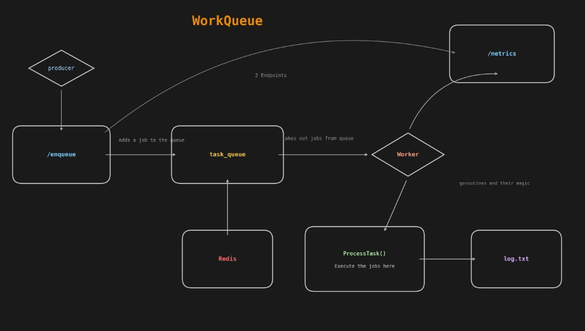

# WorkQueue

A distributed background task processing system written in Go, using Redis for job queuing.

## Services

- **Producer**: accepts new tasks via HTTP `POST /enqueue`, lists recent jobs via `GET /api/jobs` when Postgres is configured, and enables **CORS** for the web UI when `ALLOWED_ORIGINS` is set.
- **Worker**: consumes queued tasks and executes them concurrently; exposes `GET /metrics`.
- **Redis**: primary job queue (`RPUSH` / `BRPOP`).
- **Postgres** (optional but recommended for the UI): stores job rows (`pending` → `processing` → `completed` / `failed`) when `DATABASE_URL` is set on both producer and worker.
- **Web UI** (`web/`): minimal Vite + React dashboard; deploy to **Vercel** and point it at your public producer and worker URLs.

## Task format

```json
{
  "type": "send_email",
  "retries": 3,
  "payload": {
    "to": "someone@example.com",
    "subject": "Welcome!"
  }
}
```

Notes:
- `type` is required and controls which handler runs in the worker (`send_email`, `resize_image`, `generate_pdf`).
- `payload` is a free-form key/value object (any fields you want).
- `retries` controls how many times the worker will retry on failure.
- `attempts` is internal (the worker tracks it automatically).

**High level overview**



## Run locally

## Prerequisites

- `Redis` (either installed locally or via Docker)
- `Go` v1.22+ (only if you run with `go run`)
- `Docker` + `docker compose` (only if you run via `docker compose`)

### 1) Start Redis

If you already have Redis locally:

```bash
redis-server
```

Or use Docker:

```bash
docker run --rm -p 6379:6379 redis:7-alpine
```

### 2) Start producer

```bash
go run ./cmd/producer
```

Producer runs on `http://localhost:8080`.

### 3) Start worker

In another terminal:

```bash
go run ./cmd/worker
```

Worker metrics run on `http://localhost:8081/metrics`.

### 4) Web UI (optional)

From `web/`:

```bash
cd web
npm install
npm run dev
```

Open `http://localhost:5173`. The dev server proxies `/enqueue` and `/api` to `http://localhost:8080`.

For production, set `VITE_API_URL` and `VITE_WORKER_URL` (see **Deploy Railway and Vercel** below).

## Docker compose

Start everything with:

```bash
docker compose up --build
```

If you prefer background mode:

```bash
docker compose up --build -d
```

Compose now includes **Postgres** and sets `DATABASE_URL` for both services so the UI can list jobs locally.

## Environment variables

| Variable | Service | Purpose |
| --------- | -------- | -------- |
| `REDIS_URL` or `REDIS_ADDR` | Producer, Worker | Redis connection |
| `DATABASE_URL` | Producer, Worker | Postgres (job persistence + `/api/jobs`) |
| `QUEUE_NAME` | Producer, Worker | Redis list key (default `workqueue:jobs`) |
| `ALLOWED_ORIGINS` | Producer, Worker | CORS: `*` or comma-separated origins (e.g. your Vercel URL) |
| `PORT` | Producer, Worker | HTTP listen port (Railway sets this automatically) |
| `WORKER_CONCURRENCY` | Worker | Goroutine consumers (default `2`) |

## Endpoints

### Producer

- `POST /enqueue`
- `GET /api/jobs` (JSON array; empty if `DATABASE_URL` is not set)
- `GET /health`

### Worker

- `GET /metrics`
- `GET /health`

## Sample requests

Enqueue:

```bash
curl -X POST http://localhost:8080/enqueue \
  -H "Content-Type: application/json" \
  -d "{\"type\":\"send_email\",\"retries\":3,\"payload\":{\"to\":\"user@example.com\",\"subject\":\"hello\"}}"
```

Fetch metrics:

```bash
curl http://localhost:8081/metrics
```

## API Responses (examples)

### Producer: `POST /enqueue`

Success (`200 OK`):

```json
{
  "status": "queued",
  "type": "send_email",
  "retries": 3,
  "queue_name": "workqueue:jobs",
  "job_id": "550e8400-e29b-41d4-a716-446655440000"
}
```

`job_id` is present only when `DATABASE_URL` is configured on the producer.

Common error responses:

- `400 Bad Request` (invalid JSON body):
  - Response body: `invalid JSON body`
- `400 Bad Request` (`type` missing/empty):
  - Response body: `type is required`
- `400 Bad Request` (`retries` negative):
  - Response body: `retries cannot be negative`
- `500 Internal Server Error` (Redis enqueue failed):
  - Response body: `failed to enqueue task`
- `500 Internal Server Error` (Postgres insert failed):
  - Response body: `failed to persist job`

### Worker: `GET /metrics`

Response (`200 OK`):

```json
{
  "total_jobs_in_queue": 0,
  "jobs_done": 1,
  "jobs_failed": 0,
  "worker_concurrency": 3,
  "queue_name": "workqueue:jobs"
}
```

### `/health`

- `200 OK` with body: `ok`

---

## Deploy Railway and Vercel

I cannot push to your Railway or Vercel accounts from this environment; use the steps below after you connect your GitHub repo.

### Railway (backend)

1. Create a new **Postgre** database on Railway and note **`DATABASE_URL`**.
2. Add **Redis** (Railway Redis plugin or any `REDIS_URL`-compatible provider).
3. Create **two** services from this repo, both using **Dockerfile** deploy:
   - **Producer**: Dockerfile path `Dockerfile.producer`. Set variables: `REDIS_URL`, `DATABASE_URL`, `ALLOWED_ORIGINS` (your Vercel origin, e.g. `https://your-app.vercel.app`), and optionally `QUEUE_NAME`.
   - **Worker**: Dockerfile path `Dockerfile.worker`. Set the same `REDIS_URL`, `DATABASE_URL`, `ALLOWED_ORIGINS`, `QUEUE_NAME`, and `WORKER_CONCURRENCY`.
4. Railway injects **`PORT`** per service—no need to set `PRODUCER_PORT` / `WORKER_PORT` manually.
5. Copy the public **HTTPS URLs** for both services (producer and worker).

### Vercel (frontend)

1. Import the repo; set **Root Directory** to **`web`**.
2. Build command: `npm run build`, output directory: **`dist`** (Vite default).
3. Add environment variables:
   - `VITE_API_URL` = your Railway producer URL (no trailing slash), e.g. `https://producer-production.up.railway.app`
   - `VITE_WORKER_URL` = your Railway worker URL, e.g. `https://worker-production.up.railway.app`
4. Redeploy. Open the Vercel URL; you should see jobs and metrics updating.

**CORS:** `ALLOWED_ORIGINS` on both Go services must include your exact Vercel origin, or use `*` for quick tests only.

